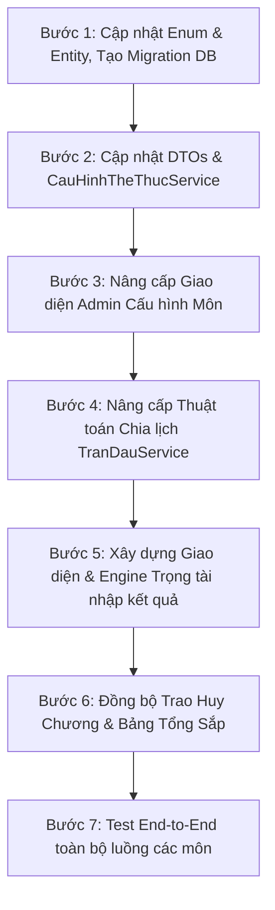

# KẾ HOẠCH NÂNG CẤP & BÓC TÁCH THỂ THỨC THI ĐẤU
### Dự án: SportHY - Quản lý Điều hành & Tổ chức Giải Thể thao

---

## I. MỤC TIÊU & PHẠM VI NÂNG CẤP

Hiện tại, hệ thống đang gộp chung toàn bộ các môn đo lường vào thể thức `TinhDiemXepHang` (Điền kinh, Bơi lội, Cử tạ, Bắn súng...). Điều này dẫn đến các hạn chế:
1. **Chưa hỗ trợ Chạy bền / Đua xe đạp:** Đang bị ép chia thành các lượt 8 làn (Lane-based), trong khi thực tế cần xuất phát đồng loạt (Mass Start).
2. **Chưa hỗ trợ môn thi theo lượt thử (Attempts):** Nhảy xa, Nhảy cao, Cử tạ cần ghi nhận nhiều lần thử (Lần 1, Lần 2, Lần 3; phạm quy/hợp lệ) thay vì 1 con số thành tích đơn lẻ.
3. **Chưa hỗ trợ môn Biểu diễn chấm điểm:** Wushu Taolu, Karate Kata, Quyền Vovinam, Thể dục dụng cụ cần nhập điểm số bài thi và điểm trừ lỗi. *(Tạm thời cấu hình 1 trọng tài bắt/nhập điểm để tối ưu hóa và đơn giản hóa quy trình)*.

*(Ghi chú: Tạm thời lược bỏ thể thức Nhánh thắng - Nhánh thua và Hệ Thụy Sĩ theo yêu cầu để tập trung hoàn thiện các thể thức cốt lõi).*

**Mục tiêu:** Chuẩn hóa hệ thống thành **6 thể thức cốt lõi**:
1. `LoaiTrucTiep` - Đấu loại trực tiếp (Knockout).
2. `VongBang` - Vòng tròn tính điểm (Round Robin).
3. `KetHopVongBangVaLoaiTrucTiep` - Vòng bảng + Knockout.
4. `DuaThoiGian` - Đua tính thời gian (Chạy ngắn, Bơi lội, Chạy bền/Marathon, Xe đạp).
5. `DoLuotThi` - Đo thành tích theo lần thực hiện (Nhảy xa, Nhảy cao, Cử tạ, Ném lao, Bắn súng).
6. `BieuDienChamDiem` - Biểu diễn / Trọng tài chấm điểm (Võ quyền, Thể dục dụng cụ - 1 trọng tài chấm).

---

## II. THAY ĐỔI CƠ SỞ DỮ LIỆU (DATABASE SCHEMA)

### 1. Cập nhật Enum `HinhThucThiDau` (`Dms.Domain.Enums.GiaiDauEnums`)
Bổ sung các giá trị mới và giữ nguyên tương thích ngược (đã lược bỏ Nhánh thắng - Nhánh thua và Hệ Thụy Sĩ):
```csharp
public enum HinhThucThiDau
{
    [Description("Loại trực tiếp (Knockout)")]
    LoaiTrucTiep = 1,

    [Description("Vòng tròn tính điểm / Vòng bảng (Round Robin)")]
    VongBang = 2,

    [Description("Kết hợp vòng bảng và loại trực tiếp (Group Stage + Knockout)")]
    KetHopVongBangVaLoaiTrucTiep = 3,

    [Description("Tính điểm xếp hạng (Legacy / Chung)")]
    TinhDiemXepHang = 6,

    [Description("Đua tính thời gian (Chạy, Bơi, Xe đạp)")]
    DuaThoiGian = 8,

    [Description("Đo theo lần thực hiện (Cử tạ, Nhảy xa, Ném tạ)")]
    DoLuotThi = 9,

    [Description("Biểu diễn / Trọng tài chấm điểm (Võ quyền, Thể dục)")]
    BieuDienChamDiem = 10,

    [Description("Khác")]
    Khac = 7
}
```

---

### 2. Bổ sung các cột mới vào bảng `CauHinhTheThucThiDau`
File: `Dms.Domain/Entities/CauHinhTheThucThiDau.cs`

| Tên cột | Kiểu dữ liệu | Nullable | Mặc định | Ý nghĩa & Mô tả |
| :--- | :--- | :--- | :--- | :--- |
| `HinhThucXuatPhat` | `nvarchar(30)` | YES | `'ChiaLan'` | Cho môn `DuaThoiGian`: `'ChiaLan'` (Bơi, chạy ngắn), `'DongLoat'` (Mass Start - chạy bền, xe đạp), `'SoLe'` (Time Trial). |
| `SoLuotThucHien` | `int` | YES | `3` | Cho môn `DoLuotThi`: Số lần thử tối đa của mỗi VĐV (VD: 3 lần, 6 lần). |
| `CachTinhKetQuaLuotThi`| `nvarchar(50)` | YES | `'LanTotNhat'` | Cho môn `DoLuotThi`: `'LanTotNhat'` (Nhảy xa, ném tạ), `'TongHaiNoiDung'` (Cử tạ: Giật + Đẩy), `'MucXaCaoNhat'` (Nhảy cao), `'TongTatCaLuot'` (Bắn súng). |
| `ThangDiemToiDa` | `decimal(18,2)`| YES | `10.0` | Cho môn `BieuDienChamDiem`: Thang điểm tối đa của bài thi (thường là 10.0 hoặc 100.0). |
| `CoDiemTruBieuDien` | `bool` | NO | `true` | Cho môn `BieuDienChamDiem`: Có ô nhập điểm trừ lỗi (vượt thảm, phạm thời gian, trang phục...) không. |

> *(Lưu ý: Phần số lượng giám khảo 3 hay 5 và thuật toán bỏ điểm biên tạm thời bỏ qua; trọng tài bàn sẽ nhập trực tiếp điểm bài thi và điểm trừ).*

---

### 3. Bổ sung cột vào bảng `KetQuaTranDau`
File: `Dms.Domain/Entities/KetQuaTranDau.cs`

Hiện tại bảng `KetQuaTranDau` chỉ có cột `GiaTri` (decimal) và `Diem` (decimal). Để lưu được lịch sử các lần nhảy (Lần 1 hỏng, Lần 2 được 7.5m...) hoặc chi tiết điểm biểu diễn mà không phá vỡ cấu trúc DB:

| Tên cột | Kiểu dữ liệu | Nullable | Mô tả |
| :--- | :--- | :--- | :--- |
| `ChiTietKetQuaJson` | `nvarchar(max)` | YES | Lưu mảng JSON chi tiết các lần thử hoặc điểm trừ lỗi. |

* **Ví dụ JSON cho môn `DoLuotThi` (Cử tạ / Nhảy xa):**
```json
[
  { "attempt": 1, "value": 110.0, "isPass": true, "note": "Hợp lệ" },
  { "attempt": 2, "value": 115.0, "isPass": false, "note": "Phạm quy (X)" },
  { "attempt": 3, "value": 118.0, "isPass": true, "note": "Hợp lệ" }
]
```
* **Ví dụ JSON cho môn `BieuDienChamDiem` (1 trọng tài chấm):**
```json
{
  "diemThucHien": 9.5,
  "diemTru": 0.2,
  "diemChinhThuc": 9.3,
  "ghiChuLoi": "Trừ 0.2 lỗi phạm quy thời gian"
}
```
* Cột `GiaTri` (decimal) gốc trong DB vẫn được lưu giá trị chung cuộc (Thành tích tốt nhất, Tổng cử, hoặc Điểm chính thức) để phục vụ **ORDER BY và xếp hạng siêu nhanh**.

---

### 4. Bổ sung cột vào bảng `ThanhPhanTranDau`
File: `Dms.Domain/Entities/ThanhPhanTranDau.cs`

| Tên cột | Kiểu dữ liệu | Nullable | Mô tả |
| :--- | :--- | :--- | :--- |
| `SoThuTuThiDau` | `int?` | YES | Thứ tự biểu diễn hoặc thứ tự vào lượt thử (1, 2, 3...). |
| `SoDeoBIB` | `nvarchar(20)`| YES | Số đeo ngực VĐV (rất quan trọng cho Chạy việt dã / Marathon / Xe đạp). |

---

## III. THAY ĐỔI TẦNG BACKEND & APPLICATION

### 1. Cập nhật `CauHinhTheThucService` & DTOs
- Thêm các trường mới vào `CauHinhTheThucDto`.
- Cập nhật hàm `GetEffectiveConfigAsync`, `SaveConfigAsync`, và giá trị mặc định cho từng môn khi tạo mới.

### 2. Thuật toán Lập lịch thi đấu (`TranDauService.cs`)
Cải tiến nhánh xếp lịch cho các môn đo lường (`effectiveHinhThuc`):

1. **Nhánh `DuaThoiGian`:**
   - Nếu `HinhThucXuatPhat == "ChiaLan"`: Giữ nguyên logic chia các Heat 6-8 làn, Vòng loại ➔ Lượt Chung kết.
   - Nếu `HinhThucXuatPhat == "DongLoat"` (Chạy bền, Marathon, Xe đạp đường trường):
     - **Tạo đúng 1 Trận đấu duy nhất** (Trận Chung kết - Mass Start).
     - Gom toàn bộ VĐV vào trận này. Cột `SoLane` để `null`, tạo sẵn `SoDeoBIB` hoặc theo thứ tự bốc thăm.
   - Nếu `HinhThucXuatPhat == "SoLe"` (Xe đạp tính giờ cá nhân):
     - Tạo 1 Trận đấu, sắp xếp thời gian xuất phát của từng VĐV cách nhau `X` phút.
2. **Nhánh `DoLuotThi` (Cử tạ, Nhảy xa):**
   - Xếp tất cả VĐV vào 1 Lượt thi chung kết (Flight). Nếu quá đông (> 16 VĐV), tự động chia làm 2 Nhóm (Nhóm A & Nhóm B).
   - Đánh số thứ tự thực hiện `SoThuTuThiDau` từ 1 đến N.
3. **Nhánh `BieuDienChamDiem` (Võ quyền, Thể dục):**
   - Tạo 1 Lượt thi biểu diễn.
   - Bốc thăm thứ tự biểu diễn ngẫu nhiên cho VĐV (`SoThuTuThiDau`).

---

### 3. Động cơ tính điểm & ghi nhận kết quả (Scoring Engines)
* Xử lý điểm cho 3 thể thức mới:
  1. `RaceTimeProgressionEngine`: Chuyên xử lý thời gian, chia làn, bốc thăm làn hạt giống, gom Top vào chung kết.
  2. `TrialScoringEngine`:
     - Nhận mảng kết quả từng lần thử của VĐV.
     - Kiểm tra trạng thái Đạt/Hỏng.
     - Tự động lấy: Lần tốt nhất (Best) hoặc Tính tổng cử tạ (Giật Max + Đẩy Max) hoặc Mức xà cao nhất.
     - Tự động gán `XepHang` (Lớn nhất về nhất).
  3. `JudgedScoringEngine` (1 trọng tài):
     - Nhận: `DiemThucHien` (Điểm bài thi) và `DiemTru` (Điểm trừ lỗi).
     - Công thức: `DiemChinhThuc = Math.Max(0, DiemThucHien - DiemTru)`.
     - Tự động gán `XepHang` (Điểm chính thức cao nhất xếp hạng 1).

---

### 4. Động cơ Trao Huy chương tự động (`HuyChuongService.cs`)
* Mở rộng điều kiện kiểm tra trong hàm `TraoHuyChuongTuDongAsync`:
```csharp
bool isPerformanceFormat = 
    hinhThuc == HinhThucThiDau.TinhDiemXepHang ||
    hinhThuc == HinhThucThiDau.DuaThoiGian ||
    hinhThuc == HinhThucThiDau.DoLuotThi ||
    hinhThuc == HinhThucThiDau.BieuDienChamDiem;

if (isPerformanceFormat)
{
    // Quét trận chung kết, lấy Top 1 -> HCV, Top 2 -> HCB, Top 3 -> HCĐ
    // Toàn bộ logic trao huy chương cũ được tái sử dụng 100% không đổi!
}
```

---

## IV. THAY ĐỔI TẦNG GIAO DIỆN (UI / FRONTEND)

### 1. Màn hình Cấu hình Môn (`Areas/Admin/Views/MonTheThao/Index.cshtml`)
* **Dropdown Thể thức thi đấu (`#fmtHinhThucThiDau`):**
  - Hiển thị 6 lựa chọn rõ ràng:
    1. Đấu loại trực tiếp
    2. Vòng tròn tính điểm
    3. Chia bảng + Loại trực tiếp
    4. ⏱️ Đua tính thời gian (Chạy, Bơi, Xe đạp, Chạy bền)
    5. 📏 Đo theo lần thực hiện (Nhảy xa, Nhảy cao, Cử tạ, Ném lao)
    6. 🥋 Biểu diễn / Chấm điểm (Võ quyền, Thể dục dụng cụ)
* **Hiển thị Form tương thích động:**
  - Khi chọn mục 4: Hiện Panel Cấu hình Đua thời gian (chọn Chia làn hay Xuất phát đồng loạt).
  - Khi chọn mục 5: Hiện Panel Lần thực hiện (chọn Số lần thử: 3 hay 6; Cách lấy kết quả: Lần tốt nhất hay Tổng cử).
  - Khi chọn mục 6: Hiện Panel Chấm điểm biểu diễn (chọn Thang điểm tối đa: 10 hay 100; có ô điểm trừ không).

---

### 2. Màn hình Trọng tài Chấm điểm (`Areas/TrongTai/Views/KetQua/Index.cshtml`)
Tách giao diện nhập điểm thành 3 template trực quan:

1. **Template 1: Đua thời gian (Time-based):**
   - *Nếu chia làn:* Giữ nguyên bảng nhập thời gian theo Làn 1..8.
   - *Nếu chạy bền / xe đạp (Mass Start):* Hiển thị bảng danh sách VĐV có cột **Số BIB**, ô nhập **Thời gian cán đích (hh:mm:ss.xxx)**, nút bấm nhanh xếp thứ tự về đích.
2. **Template 2: Lần thực hiện (Attempt Matrix):**
   - Hiển thị bảng dạng ma trận:
     - Cột VĐV & Đơn vị.
     - Các cột `Lần 1`, `Lần 2`, `Lần 3`... Mỗi ô cho phép gõ số hoặc bấm nút nhanh `[X - Hỏng]`.
     - Cột `Thành tích công nhận`: Tự động tính real-time bằng JS khi trọng tài nhập.
     - Cột `Xếp hạng tạm thời`.
3. **Template 3: Biểu diễn (1 trọng tài chấm):**
   - Danh sách VĐV theo thứ tự biểu diễn (STT 1, 2, 3...).
   - Bảng nhập đơn giản, rõ ràng:
     - Ô **Điểm bài thi** (VD: 9.5).
     - Ô **Điểm trừ lỗi** (VD: 0.2).
     - Cột **Điểm chính thức** (Tự động tính: 9.3).
     - Cột **Xếp hạng tạm thời** (Tự động cập nhật ngay khi nhập).

---

## V. LỘ TRÌNH TRIỂN KHAI TỪNG BƯỚC (STEP-BY-STEP ROADMAP)



* **Giai đoạn 1 (Nền tảng):** Bước 1 + Bước 2 (Cơ sở dữ liệu và cấu hình).
* **Giai đoạn 2 (Vận hành & Lập lịch):** Bước 3 + Bước 4 (Admin chọn thể thức và xếp lịch ra trận đấu chuẩn).
* **Giai đoạn 3 (Thi đấu & Thành tích):** Bước 5 + Bước 6 (Trọng tài nhập điểm từng môn và tự động trao huy chương).

---

## VI. KẾT LUẬN & ĐÁNH GIÁ TÍNH KHẢ THI

1. **Gọn gàng và thiết thực:** Việc tạm thời lược bỏ Nhánh thắng - thua, Hệ Thụy Sĩ và giới hạn môn biểu diễn ở 1 trọng tài giúp hệ thống vừa vặn, không bị cồng kềnh, tập trung đúng vào nghiệp vụ cốt lõi đang cần.
2. **Không làm hỏng dữ liệu cũ:** Bằng cách giữ nguyên các trường cũ và bổ sung cột mới (`ChiTietKetQuaJson`, `HinhThucXuatPhat`...), toàn bộ các giải đấu và môn thể thao đã cấu hình trước đó vẫn hoạt động bình thường mà không bị lỗi.
3. **Phần Huy chương:** Đã hoàn toàn sẵn sàng, chỉ cần bổ sung tên thể thức vào điều kiện quét Top 1, 2, 3 là tự động trao huy chương và cập nhật bảng tổng sắp của các đơn vị.
